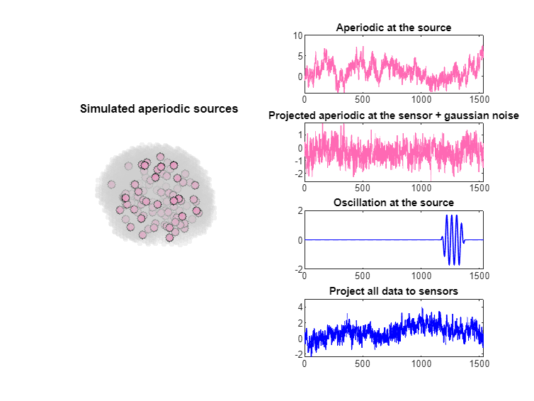
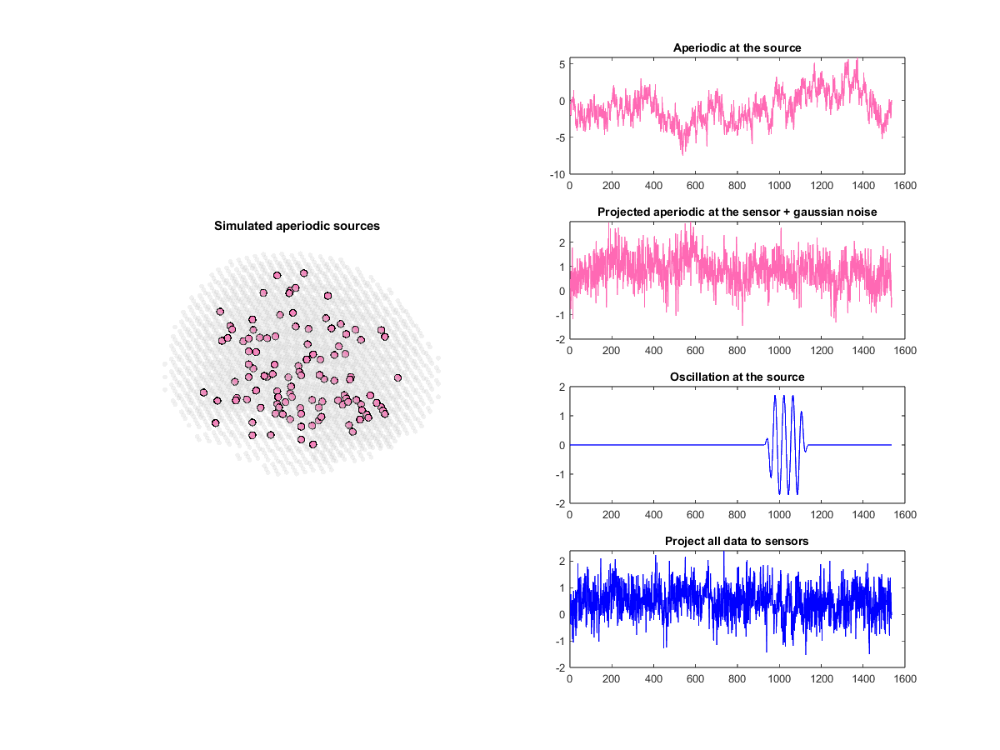
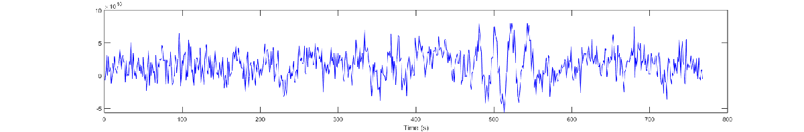
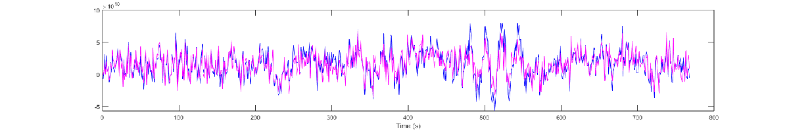
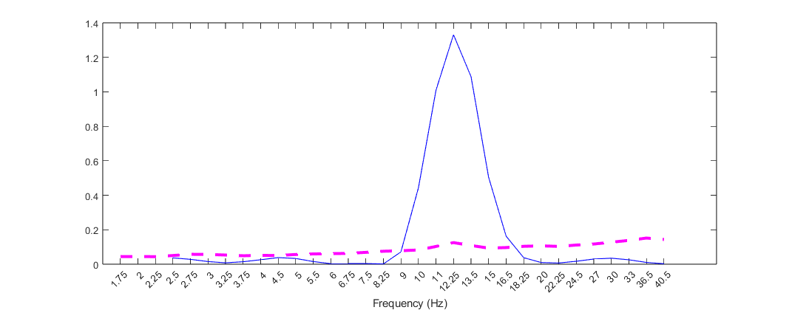
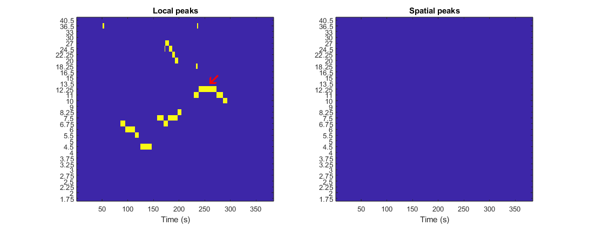
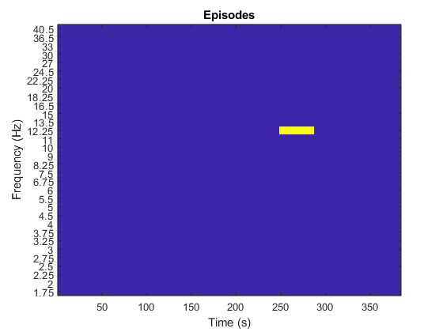

# sBOSC: Oscillatory episodes detection at neural sources.
# **Overview**

sBOSC (source\-BOSC) is a MATLAB\-based open\-source toolbox designed to detect and localize neural oscillations directly within the brain's source space.


Detecting genuine oscillatory generators from MEG sensors is challenging due to source leakage\- where activity from one region spreads across neighboring voxels. To adress this limitation, sBOSC follows the next steps:

-  Source\-reconstruction: sBOSC analyzes reconstructed source\-level data to identify oscillatory anatomical generators. 
-  Power thresholding: aperiodic activity is isolated using the specparam algorithm (formerly FOOOF).  
-  Local and spatial peak verification: oscillatory events must exhibit a peak rising above the 1/f activity. Additionally, they must be maxima among its neighbors to mitigate spatial leakage. 
-  Duration criterion: a minimum number of consecutive cycles is required. 
# **Dependencies**
-  Image processing toolbox (MATLAB) 
-  Statistics and machine learning toolbox (MATLAB)  
-  Optimization toolbox (MATLAB) 
-  Fieldtrip (v20230118): https://www.fieldtriptoolbox.org/ 
-  Brainstorm (FOOOF wrapper): https://neuroimage.usc.edu/brainstorm/Tutorials/Fooof 
# **Quick start**
```matlab

% sBOSC path
addpath(genpath('Z:\Toolbox\sourceBOSC')) % sBOSC path

% Fieldtrip path
addpath('Z:\Toolbox\fieldtrip-20230118')  % Fieldtrip path
ft_defaults

```

Lets begin by generating a realistic simulated MEG signal. The aperiodic (1/f) background activity is modeled by distributing random signal generators across the brain, selecting one voxel per region of interes (ROI) defined by the AAL atlas.


We then add a discrete 12 Hz sinusoidal oscillatory event directly into a user\-defined voxel.

```matlab
                % Step 1: Simulate signal
                    cfg = [];
                    cfg.apgenerators = 'roi';
                    cfg.fsample  = 512;
                    cfg.length = 3;
                    cfg.figures = 'yes';
                    
                    % Events
                    cfg.events = [];
                    cfg.events(1).voxel  = 2963;
                    cfg.events(1).freq   = 12;
                    cfg.events(1).cycles = 5;
                    cfg.events(1).snr = 1;
                    cfg.events(1).coexist_with = 0;
                    cfg.events(1).shape = 'sine';
                    cfg.events(1).snr_domain = 'source';
                    cfg.events(1).centered = 'no';
                    simsignal = sBOSC_SimulateSignalSource(cfg);
```

```matlabTextOutput
the coordinate system appears to be 'aligned'
the input is source data with 6804 brainordinates on a [18 21 18] grid
could not reshape "dtempl" to the dimensions of the volume
the input is segmented volume data with dimensions [91 109 91]
the volume of each of the segmented compartments in "tissue" is
Precentral_L         :       28 ml (  0.39 %)
Precentral_R         :       27 ml (  0.37 %)
Frontal_Sup_L        :       29 ml (  0.40 %)
Frontal_Sup_R        :       32 ml (  0.45 %)
Frontal_Sup_Orb_L    :        8 ml (  0.11 %)
Frontal_Sup_Orb_R    :        8 ml (  0.11 %)
Frontal_Mid_L        :       39 ml (  0.54 %)
Frontal_Mid_R        :       41 ml (  0.57 %)
Frontal_Mid_Orb_L    :        7 ml (  0.10 %)
Frontal_Mid_Orb_R    :        8 ml (  0.11 %)
Frontal_Inf_Oper_L   :        8 ml (  0.11 %)
Frontal_Inf_Oper_R   :       11 ml (  0.15 %)
Frontal_Inf_Tri_L    :       20 ml (  0.28 %)
Frontal_Inf_Tri_R    :       17 ml (  0.24 %)
Frontal_Inf_Orb_L    :       14 ml (  0.19 %)
Frontal_Inf_Orb_R    :       14 ml (  0.19 %)
Rolandic_Oper_L      :        8 ml (  0.11 %)
Rolandic_Oper_R      :       11 ml (  0.15 %)
Supp_Motor_Area_L    :       17 ml (  0.24 %)
Supp_Motor_Area_R    :       19 ml (  0.26 %)
Olfactory_L          :        2 ml (  0.03 %)
Olfactory_R          :        2 ml (  0.03 %)
Frontal_Sup_Medial_L :       24 ml (  0.33 %)
Frontal_Sup_Medial_R :       17 ml (  0.24 %)
Frontal_Med_Orb_L    :        6 ml (  0.08 %)
Frontal_Med_Orb_R    :        7 ml (  0.09 %)
Rectus_L             :        7 ml (  0.09 %)
Rectus_R             :        6 ml (  0.08 %)
Insula_L             :       15 ml (  0.21 %)
Insula_R             :       14 ml (  0.20 %)
Cingulum_Ant_L       :       11 ml (  0.16 %)
Cingulum_Ant_R       :       11 ml (  0.15 %)
Cingulum_Mid_L       :       16 ml (  0.22 %)
Cingulum_Mid_R       :       18 ml (  0.24 %)
Cingulum_Post_L      :        4 ml (  0.05 %)
Cingulum_Post_R      :        3 ml (  0.04 %)
Hippocampus_L        :        7 ml (  0.10 %)
Hippocampus_R        :        8 ml (  0.10 %)
ParaHippocampal_L    :        8 ml (  0.11 %)
ParaHippocampal_R    :        9 ml (  0.13 %)
Amygdala_L           :        2 ml (  0.02 %)
Amygdala_R           :        2 ml (  0.03 %)
Calcarine_L          :       18 ml (  0.25 %)
Calcarine_R          :       15 ml (  0.21 %)
Cuneus_L             :       12 ml (  0.17 %)
Cuneus_R             :       11 ml (  0.16 %)
Lingual_L            :       17 ml (  0.23 %)
Lingual_R            :       18 ml (  0.25 %)
Occipital_Sup_L      :       11 ml (  0.15 %)
Occipital_Sup_R      :       11 ml (  0.16 %)
Occipital_Mid_L      :       26 ml (  0.36 %)
Occipital_Mid_R      :       17 ml (  0.23 %)
Occipital_Inf_L      :        8 ml (  0.10 %)
Occipital_Inf_R      :        8 ml (  0.11 %)
Fusiform_L           :       18 ml (  0.26 %)
Fusiform_R           :       20 ml (  0.28 %)
Postcentral_L        :       31 ml (  0.43 %)
Postcentral_R        :       31 ml (  0.42 %)
Parietal_Sup_L       :       17 ml (  0.23 %)
Parietal_Sup_R       :       18 ml (  0.25 %)
Parietal_Inf_L       :       20 ml (  0.27 %)
Parietal_Inf_R       :       11 ml (  0.15 %)
SupraMarginal_L      :       10 ml (  0.14 %)
SupraMarginal_R      :       16 ml (  0.22 %)
Angular_L            :        9 ml (  0.13 %)
Angular_R            :       14 ml (  0.19 %)
Precuneus_L          :       28 ml (  0.39 %)
Precuneus_R          :       26 ml (  0.36 %)
Paracentral_Lobule_L :       11 ml (  0.15 %)
Paracentral_Lobule_R :        7 ml (  0.09 %)
Caudate_L            :        8 ml (  0.11 %)
Caudate_R            :        8 ml (  0.11 %)
Putamen_L            :        8 ml (  0.11 %)
Putamen_R            :        9 ml (  0.12 %)
Pallidum_L           :        2 ml (  0.03 %)
Pallidum_R           :        2 ml (  0.03 %)
Thalamus_L           :        9 ml (  0.12 %)
Thalamus_R           :        8 ml (  0.12 %)
Heschl_L             :        2 ml (  0.02 %)
Heschl_R             :        2 ml (  0.03 %)
Temporal_Sup_L       :       18 ml (  0.25 %)
Temporal_Sup_R       :       25 ml (  0.35 %)
Temporal_Pole_Sup_L  :       10 ml (  0.14 %)
Temporal_Pole_Sup_R  :       11 ml (  0.15 %)
Temporal_Mid_L       :       40 ml (  0.55 %)
Temporal_Mid_R       :       35 ml (  0.49 %)
Temporal_Pole_Mid_L  :        6 ml (  0.08 %)
Temporal_Pole_Mid_R  :        9 ml (  0.13 %)
Temporal_Inf_L       :       26 ml (  0.35 %)
Temporal_Inf_R       :       28 ml (  0.39 %)
Cerebellum_Crus1_L   :       21 ml (  0.29 %)
Cerebellum_Crus1_R   :       21 ml (  0.29 %)
Cerebellum_Crus2_L   :       15 ml (  0.21 %)
Cerebellum_Crus2_R   :       17 ml (  0.23 %)
Cerebellum_3_L       :        1 ml (  0.02 %)
Cerebellum_3_R       :        2 ml (  0.02 %)
Cerebellum_4_5_L     :        9 ml (  0.12 %)
Cerebellum_4_5_R     :        7 ml (  0.10 %)
Cerebellum_6_L       :       14 ml (  0.19 %)
Cerebellum_6_R       :       14 ml (  0.20 %)
Cerebellum_7b_L      :        5 ml (  0.06 %)
Cerebellum_7b_R      :        4 ml (  0.06 %)
Cerebellum_8_L       :       15 ml (  0.21 %)
Cerebellum_8_R       :       18 ml (  0.26 %)
Cerebellum_9_L       :        7 ml (  0.10 %)
Cerebellum_9_R       :        6 ml (  0.09 %)
Cerebellum_10_L      :        1 ml (  0.02 %)
Cerebellum_10_R      :        1 ml (  0.02 %)
Vermis_1_2           :        0 ml (  0.01 %)
Vermis_3             :        2 ml (  0.03 %)
Vermis_4_5           :        5 ml (  0.07 %)
Vermis_6             :        3 ml (  0.04 %)
Vermis_7             :        2 ml (  0.02 %)
Vermis_8             :        2 ml (  0.03 %)
Vermis_9             :        1 ml (  0.02 %)
Vermis_10            :        1 ml (  0.01 %)
total segmented      :     1483 ml ( 20.54 %)
total volume         :     7221 ml (100.00 %)
selecting subvolume of 94.4%
reslicing and interpolating tissue
interpolating
interpolating 99.9
the call to "ft_sourceinterpolate" took 1 seconds
```



sBOSC looks for spatial peaks across the 3D brain volume. Therefore, we must transform our sensor-level data into the source space. We use beamforming to reconstruct the neural activity at each voxel. 

```matlab
                % Step 2: Source-reconstruction
```

```matlabTextOutput
Warning: use cfg.headmodel instead of cfg.vol
 In ft_checkconfig at line 105
 In ft_prepare_leadfield at line 135
Warning: use cfg.sourcemodel instead of cfg.grid
 In ft_checkconfig at line 105
 In ft_prepare_leadfield at line 136

using gradiometers specified in the configuration
computing surface normals
creating sourcemodel based on user specified dipole positions
using gradiometers specified in the configuration
3423 dipoles inside, 3381 dipoles outside brain
the call to "ft_prepare_sourcemodel" took 0 seconds
computing leadfield
computing leadfield 3215/3423
```

```matlab
                    simsignal_source = sBOSC_SimulateBeamformer(simsignal);
```

The brain\-reconstructed activity of the selected voxel is displayed.





For the next step, we need to remove the aperiodic activity (1/f) from our signal using the specparam algorithm. Rather than processing the entire recording at once, the signal is segmented into shorter temporal windows (here 1.5 seconds). In the case of trial\-based data, this segments can be single trials or blocks of trials. Within each window, sBOSC extracts the aperiodic power spectrum and reconstruct it back to time domain via inverse Fast Fourier Transform (IFFT). This yields a continuous aperiodic time\-series that captures dynamic shifts in the signal.

```matlab
                % Step 3: Aperiodic
                    cfg = [];
                    cfg.datatype   = 'continuous'; 
                    cfg.windowlength = 1;
                    sim_aperiodic = sBOSC_aperiodic(simsignal_source, cfg);
```

The result is the aperiodic time signal, ideally containing no oscillatory activity.





This isolated aperiodic time signal is essential for establishing a robust power threshold to detect true oscillations. We perform a time\-frequency decomposition on the original source\-reconstructed signal (blue). Crucially, we apply the exact same time\-frequency transformation to the reconstructed aperiodic signal (pink). This yields two parallel power spectra, allowing us to directly extract a power threshold equal to a percentile (95%) of this aperiodic power spectrum. 

```matlab
                % Step 4: Powspctm and threshold
                    cfg = [];
                    cfg.frex = exp(0.6:0.1:3.7);
                    cfg.apthshld = 95;
                    [powspctm, thshld, frex, fsample] = sBOSC_timefreq(simsignal_source, sim_aperiodic, cfg);
```

Any time\-frequency point in the original power spectrum that exceeds this threshold is flagged as a potential oscillatory episode. In the provided example, a time\-point containing the simulated oscillation shows a broad peak around 12 Hz exceeding the aperiodic threshold.





Because true oscillations must manifest as spectral peaks above the 1/f, the toolbox first identifies local maxima across the time\-frequency spectrum. Subsequently, these flagged time\-frequency points are evaluated in the 3D source space. To be retained as genuine events, they must also be local maxima compared to their neighboring voxels, confirming them as true spatial peaks.

```matlab
                % Step 5: Spatial peaks
                    cfg = [];
                    [spatialpks, localpks] = sBOSC_spatialpeaks(powspctm, thshld, cfg);
```

In some instances, the exact voxel we simulated may exhibit local spectral maxima but fail to survive as the true spatial maximum. This happens when a neighboring voxel captures greater oscillatory power due to inherent source\-reconstruction imprecision and spatial leakage. 





To compensate for this uncertainty, sBOSC applies a spatial smoothing across voxels within a 1.5 cm radius. We are now ready to identify oscillatory episodes. The final requisite for identifying genuine oscillatory episodes is a minimum duration threshold, with 3 consecutive cycles being the standard in the literature. 

```matlab
                % Step 6: Construct episodes
                    cfg = [];
                    cfg.frex = frex;
                    cfg.fsample = fsample;
                    cfg.min_cycles = 3;
                    [episodes, episocc] = sBOSC_episodes(spatialpks, powspctm, cfg);
```

We have recovered out simulated episode at the simulated source!





This last step connects adjacent episodes to account for transient disconnections caused by noise or threshold fluctuations. By evaluating spectral and temporal proximity of detected episodes, sBOSC\_connect\_episodes merges fragmented segments into a single, cohesive oscillatory event.

```matlab
                % Step 7: Connect episodes
                    cfg = [];
                    cfg.fsample = fsample;
                    cfg.frex = frex;
                    cfg.time = size(spatialpks,4);
                    [conepis, conepisocc] = sBOSC_connect_episodes(cfg, episodes);
```
# **Reference**

If you use sBOSC in your research, please cite:

```matlab
Stern, E., Niso, G., & Capilla, A. (2025). pBOSC: A method for source-level identification of neural oscillations in electromagnetic brain signals. bioRxiv, 2025.07.20.665618. https://doi.org/10.1101/2025.07.20.665618

```
