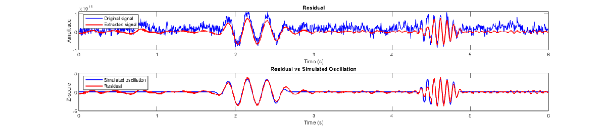
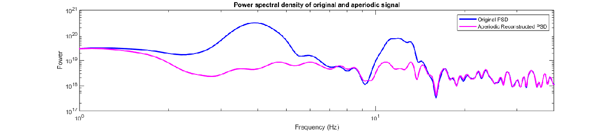
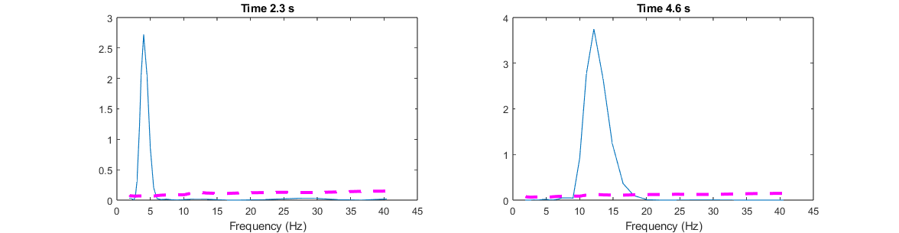
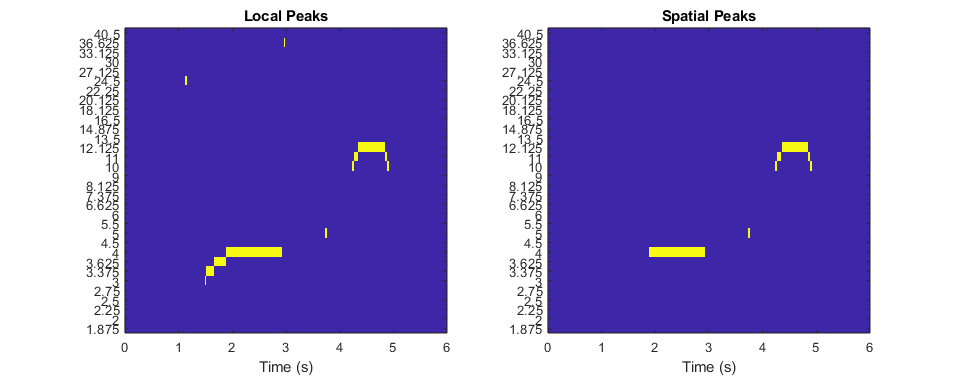
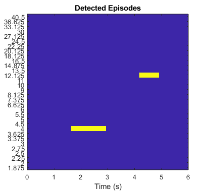

# sBOSC: Oscillatory episodes detection at neural sources.
# **Overview**

sBOSC (source\-BOSC) is a MATLAB\-based open\-source toolbox designed to detect and localize neural oscillations directly within the brain's source space.


Detecting genuine oscillatory generators from MEG sensors is challenging due to source leakage\- where activity from one region spreads across neighboring voxels. To adress this limitation, sBOSC follows the next steps:

-  Source\-reconstruction: sBOSC analyzes reconstructed source\-level data to identify oscillatory anatomical generators. 
-  Power thresholding: aperiodic activity is isolated using the specparam algorithm (formerly FOOOF).  
-  Local and spatial peak verification: oscillatory events must exhibit a peak rising above the 1/f activity. Additionally, they must be maxima among its neighbors to mitigate spatial leakage. 
-  Duration criterion: a minimum number of consecutive cycles is required. 
# **Dependencies**
-  Image processing toolbox (MATLAB) 
-  Statistics and machine learning toolbox (MATLAB)  
-  Optimization toolbox (MATLAB) 
-  Fieldtrip (v20230118): https://www.fieldtriptoolbox.org/ 
-  Brainstorm (FOOOF wrapper): https://neuroimage.usc.edu/brainstorm/Tutorials/Fooof 
# **Quick start**
```matlab

% sBOSC path
addpath(genpath('Z:\Toolbox\sourceBOSC')) % sBOSC path

% Fieldtrip path
addpath('Z:\Toolbox\fieldtrip-20230118')  % Fieldtrip path
ft_defaults

```

Lets begin by generating a realistic simulated MEG signal. The aperiodic (1/f) background activity is modeled by distributing random signal generators across the brain, selecting one voxel per region of interes (ROI) defined by the AAL atlas.


We then add a few consecutive cycles of 12 Hz and 4 Hz sinusoidal events, directly into a user\-defined voxel.

```matlab
                % Step 1: Simulate signal
                    cfg = [];
                    cfg.apgenerators = 'roi';
                    cfg.fsample  = 512;
                    cfg.length = 6;
                    cfg.figures = 'yes';
                    
                    % Events
                    cfg.events = [];
                    cfg.events(1).voxel  = 2963;
                    cfg.events(1).freq   = 12;
                    cfg.events(1).cycles = 7;
                    cfg.events(1).snr = 1;
                    cfg.events(1).coexist_with = 0;
                    cfg.events(1).shape = 'sine';
                    cfg.events(1).snr_domain = 'source';
                    cfg.events(1).centered = 'no';

                    cfg.events(2).voxel  = 2963;
                    cfg.events(2).freq   = 4;
                    cfg.events(2).cycles = 4;
                    cfg.events(2).snr = 1;
                    cfg.events(2).coexist_with = 0;
                    cfg.events(2).shape = 'sine';
                    cfg.events(2).snr_domain = 'source';
                    cfg.events(2).centered = 'no';

                    simsignal = sBOSC_SimulateSignalSource(cfg);
```


While the simulated oscillations can be observed at individual MEG sensors, sBOSC is designed to identify spatial peaks across the 3D brain volume. Therefore, we must transform our sensor\-level recordings into the source space, using a beamformer to reconstruct the neural activity at each voxel.

```matlab
                % Step 2: Source-reconstruction
                    simsignal_source = sBOSC_SimulateBeamformer(simsignal);
```

The reconstructed source activity of the selected voxel is displayed below. Because the signal\-to\-noise ratio (SNR) was set to 1 at the source level, the simulated oscillations can be easily identified by eye.


Next, we isolate the aperiodic (1/f) background activity using the specparam algorithm. Rather than processing the entire recording at once, the signal is segmented into shorter overlapping temporal windows (here, 3 seconds). For trial\-based data, these segments can be single trials or blocks of trials. Within each window, sBOSC extracts the aperiodic power spectrum and reconstructs it back into the time domain via the inverse Fast Fourier Transform (IFFT). This dynamic approach yields a continuous aperiodic time\-series that captures temporal shifts in the signal's background.

```matlab
                % Step 3: Aperiodic
                    cfg = [];
                    cfg.datatype   = 'continuous'; 
                    cfg.windowlength = 3;
                    sim_aperiodic = sBOSC_aperiodic(simsignal_source, cfg);
```

For each overlapping segment, the specparam algorithm identifies spectral peaks, which are then removed from the power spectrum. Note the 4 and 12 hz peaks.


The resulting aperiodic signal is intended to be free of oscillatory components.


We can also examine the component removed from the spectrum to verify that it matches our simulated oscillatory signal. Notice how adjacent frequencies are also captured alongside the main oscillation. Because time\-limited oscillatory bursts are not infinitely narrow in the frequency domain, their energy 'leaks' into neighboring frequencies. The specparam algorithm detects this spectral leakage as additional smaller peaks, removing them even though no independent oscillations were simulated at those specific frequencies. Users can tune the peak detection settings via the cfg.fooof structure.





By plotting the power spectra together, we can verify that the aperiodic component traces the original signal's 1/f background, with the detected frequency peaks at 4 and 12 Hz successfully removed.


This isolated aperiodic time signal is essential for establishing a robust power threshold to detect true oscillations. We perform a time\-frequency decomposition on the original source\-reconstructed signal (blue). Crucially, we apply the exact same time\-frequency transformation to the reconstructed aperiodic signal (pink). This yields two parallel power spectra, allowing us to directly extract a power threshold equal to a percentile (95%) of this aperiodic power spectrum. 

```matlab
                % Step 4: Powspctm and threshold
                    cfg = [];
                    cfg.frex = exp(0.6:0.1:3.7);
                    cfg.apthshld = 95;
                    [powspctm, thshld, frex, fsample] = sBOSC_timefreq(simsignal_source, sim_aperiodic, cfg);

```

Any time\-frequency point in the original power spectrum that exceeds this threshold is flagged as a potential oscillatory episode. In the provided example, a time\-point containing the simulated oscillation shows a peak around 4 Hz exceeding the aperiodic threshold. A similar case occurs when the 12 Hz oscillation is active.





Because true oscillations must manifest as spectral peaks above the 1/f, the toolbox first identifies local maxima across the time\-frequency spectrum. Subsequently, these flagged time\-frequency points are evaluated in the 3D source space. To be retained as genuine events, they must also be local maxima compared to their neighboring voxels, confirming them as true spatial peaks.

```matlab
                % Step 5: Spatial peaks
                    cfg = [];
                    [spatialpks, localpks] = sBOSC_spatialpeaks(powspctm, thshld, cfg);

```

In some instances, the exact voxel we simulated may exhibit local spectral maxima but fail to survive as the true spatial maximum. This happens when a neighboring voxel captures greater oscillatory power due to inherent source\-reconstruction imprecision and spatial leakage. 





To compensate for this uncertainty, sBOSC applies a spatial smoothing across voxels within a 1.5 cm radius. We are now ready to identify oscillatory episodes. The final requisite for identifying genuine oscillatory episodes is a minimum duration threshold, with 3 consecutive cycles being the standard in the literature. 

```matlab
                % Step 6: Construct episodes
                    cfg = [];
                    cfg.frex = frex;
                    cfg.fsample = fsample;
                    cfg.min_cycles = 3;
                    [episodes, episocc] = sBOSC_episodes(spatialpks, powspctm, cfg);

```

We have recovered our simulated episodes at the simulated source! 





This last step connects adjacent episodes to account for transient disconnections caused by noise or threshold fluctuations. By evaluating spectral and temporal proximity of detected episodes, sBOSC\_connect\_episodes merges fragmented segments into a single, cohesive oscillatory event.

```matlab
                % Step 7: Connect episodes
                    cfg = [];
                    cfg.fsample = fsample;
                    cfg.frex = frex;
                    cfg.time = size(spatialpks,4);
                    [conepis, conepisocc] = sBOSC_connect_episodes(cfg, episodes);
```
# **Reference**

If you use sBOSC in your research, please cite:

```matlab
Stern, E., Niso, G., & Capilla, A. (2025). sBOSC: A method for source-level identification of neural oscillations in electromagnetic brain signals. bioRxiv, 2025.07.20.665618. https://doi.org/10.1101/2025.07.20.665618

```
